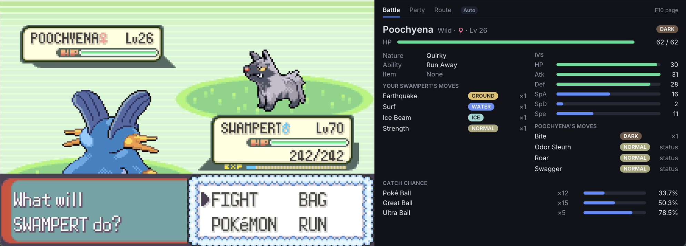
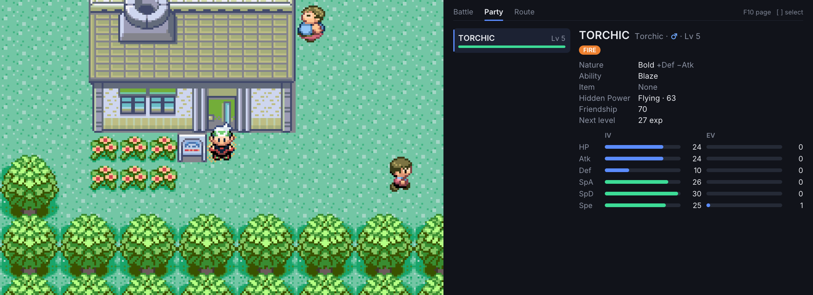
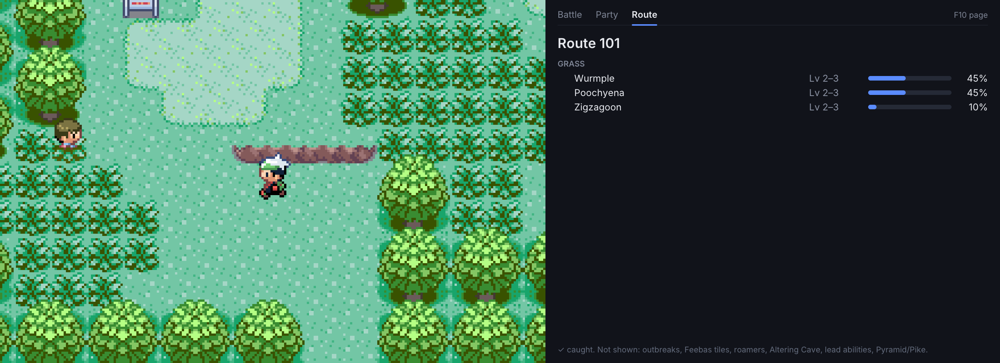

# GBA Emulator

[](https://github.com/amyanger/gba-emulator/actions/workflows/ci.yml)
[](https://github.com/amyanger/gba-emulator/actions/workflows/release.yml)
[](https://github.com/amyanger/gba-emulator/releases/latest)

A Game Boy Advance emulator written from scratch in C, featuring **Hardware X-Ray Mode** — a real-time visualization of what the GBA hardware is actually doing while a game runs.

No other GBA emulator offers this. Every emulator is a black box. This one lets you see inside.

Built around an ARM7TDMI CPU interpreter, scanline-based PPU, and an SDL2 frontend. No external libraries beyond SDL2. Pokemon Emerald is fully playable end-to-end.

## Hardware X-Ray Mode

Press **F2** during gameplay to open a second window showing live hardware internals:

- **PPU Layer Decomposition** — Each background layer and sprites rendered separately, plus a color-coded overlay showing which layer produced every pixel on screen
- **Tile & Palette Inspector** — VRAM tile grids for all 6 charblocks and full BG/OBJ palette color displays
- **CPU State** — Live registers (R0-R15), CPSR flags (N/Z/C/V/I/F/T), CPU mode, pipeline state, and cycles-per-second counter
- **Audio Monitor** — Master output waveforms (L/R oscilloscope), FIFO A/B fill meters, and legacy channel status (duty, frequency, volume, LFSR)
- **DMA / Timer / IRQ Activity** — All 4 timers and DMA channels with live counters, plus named IRQ flags with red flash indicators on every event

X-Ray Mode adds zero overhead when disabled. It's compile-time gated (`ENABLE_XRAY`, default ON) and runtime gated (null-pointer checks on every hook). The game runs identically whether X-Ray is open or closed.

### Build without X-Ray (if you want a minimal binary)

```bash
cmake .. -DENABLE_XRAY=OFF
```

## Game info panel

Press **F9** to open a side panel next to the game. The panel has a dark dashboard look with tabs along the top, type-colored pills, IV and EV bars, colored move matchups and catch odds bars.

| Key | Panel action |
|-----|--------------|
| F9 | Show or hide the panel |
| F10 | Cycle the page: Auto, Party, Route. Auto shows the battle page during a battle and the route page otherwise. |
| [ and ] | Select the previous or next Pokemon on the Party page |

On macOS, hold **fn** with the F-keys (fn+F9, fn+F10), unless your keyboard is set to use F1, F2 and so on as standard function keys. `[` and `]` only work on the Party page, and only when they are not bound to a GBA button in a custom keymap.

### Battle

The opposing Pokemon's species, level, HP, types, nature, IVs, ability and held item, how your active Pokemon's moves match up against it, and, in wild battles, the catch chance for each ball in your bag.



### Party

Each Pokemon's nature, ability, held item, Hidden Power type and power, friendship, experience to the next level, IVs and EVs. Use `[` and `]` to move between Pokemon.



### Route

The name of the route, town or city you're in, read from the game's region map, and its wild encounter table with level ranges and odds. Pokemon you've caught are marked with a check.



### Details

The panel sizes itself to the screen's pixel density, so it stays crisp on standard monitors, Windows display scaling, Retina and 4K. `--scale` only sets the size of the game. The panel is 600 by 480 points, the window is at least 480 points tall while the panel is open, and the game is centered vertically. In fullscreen (F11) the game grows to fill the screen with the panel beside it. On Linux X11 the panel uses the display DPI only when it indicates a high-DPI screen; otherwise it uses 1.0.

Supported ROM: US Emerald rev 0 (game code BPEE) only. Any other ROM shows "No game info for this ROM". Every name and number is read from your own ROM at runtime, and nothing from the game ships with the emulator. The panel only reads memory. It never writes to the game, makes no bus accesses, does not change timing, and leaves savestates untouched. Addresses come from the pret/pokeemerald decomp.

Not shown yet: Safari Ball odds, mass outbreaks, Feebas tiles, roamers, Altering Cave variants, lead ability effects (Static, Magnet Pull and similar), and Battle Pyramid and Battle Pike tables. Weather Ball matchups use its base type.

To check decoded state without a window, run headless with `--game-dump <file>` (see Headless mode).

## Features

- **ARM7TDMI CPU** — Full ARM (32-bit) and Thumb (16-bit) instruction set
  - All 16 condition codes, barrel shifter, multiply/multiply-long
  - 3-stage pipeline emulation with proper PC offset handling
  - 7 CPU modes with banked register switching
  - HLE BIOS for running without a BIOS dump
  - GamePak wait states (WAITCNT) and prefetch buffer timing
- **PPU (Graphics)** — Scanline-based renderer
  - Tiled backgrounds: Mode 0 (4 regular), Mode 1 (2 regular + 1 affine), Mode 2 (2 affine)
  - Bitmap modes: Mode 3 (16-bit), Mode 4 (8-bit palettized), Mode 5 (16-bit small)
  - OAM sprites with priority, flipping, and affine transforms
  - Alpha blending, brightness fade, priority-based layer compositing
- **APU (Audio)** — Full audio pipeline
  - Legacy GB channels: 2 square (with sweep), wave table, noise (LFSR)
  - DirectSound FIFO A/B with timer-driven DMA refill chain
  - 32768 Hz stereo output via SDL2
- **DMA Controller** — 4-channel with immediate, VBlank, HBlank, and FIFO timing modes
- **Timers** — 4 cascadable 16-bit timers with prescaler and IRQ generation, with timer IRQs raised on the cycle they overflow
- **Interrupts** — IE/IF/IME with write-1-to-clear semantics
- **Flash 64K / 128K Save** — Macronix and SST/Atmel/Panasonic chip IDs (Pokemon Emerald, Ruby, Sapphire, FireRed, LeafGreen)
- **Real-Time Clock** — S-3511A serial RTC over GPIO (0x080000C4/C6/C8) with persistent offset stored in the `.sav` trailer
- **Cartridge** — ROM loading (up to 32MB), auto save detection, file persistence next to the ROM
- **Game info panel (Pokemon Emerald)**: press F9 for a side panel with wild battle IVs, natures, catch odds per ball, move matchups, your party's IVs/EVs/Hidden Power, and the current location's name and encounter table, in a dark dashboard layout.
- **Save States** — 10 numbered slots (0–9), versioned and ROM-hash guarded, written next to the ROM as `<rom>.ss<N>`
- **Cheats** — GameShark / Action Replay v1–v3 + CodeBreaker, loaded from a `.cht` file
- **Fast-Forward** — Hold Tab or toggle with `` ` `` (skips audio, renders every Nth frame)
- **Rewind** — Hold Backspace to step back through the last 60 seconds (LZ4-compressed snapshots in RAM, capped at 256 MB, audio muted while rewinding)
- **Input** — Active-low KEYINPUT register with SDL2 keyboard mapping
- **Link Cable (local)** — Two-instance Multiplayer mode SIO over an AF_UNIX socket (`--link-master`/`--link-client`)
- **SDL2 Frontend** — Windowed or fullscreen rendering, configurable scale, audio-driven frame sync

## Download a pre-built binary

Pre-built binaries for Linux (x86_64), macOS (Apple Silicon), and Windows (x86_64) are attached to every tagged release on the [Releases page](https://github.com/amyanger/gba-emulator/releases/latest).

The Linux and macOS binaries are dynamically linked against SDL2, so you'll need SDL2 installed on your system before running them. The Windows zip bundles `SDL2.dll`.

### macOS (Apple Silicon — M1/M2/M3/M4/M5)

```bash
brew install sdl2
curl -L -O https://github.com/amyanger/gba-emulator/releases/latest/download/gba_emulator-0.3.0-Darwin-arm64.tar.gz
tar -xzf gba_emulator-0.3.0-Darwin-arm64.tar.gz
xattr -d com.apple.quarantine gba_emulator-0.3.0-Darwin-arm64/bin/gba_emulator
./gba_emulator-0.3.0-Darwin-arm64/bin/gba_emulator path/to/rom.gba --scale 3
```

The `xattr` line clears the Gatekeeper quarantine flag so macOS will run the unsigned binary. Skip it on your own risk and you'll see a "developer cannot be verified" prompt instead.

### Linux (x86_64)

```bash
sudo apt install libsdl2-2.0-0   # or your distro's SDL2 runtime package
curl -L -O https://github.com/amyanger/gba-emulator/releases/latest/download/gba_emulator-0.3.0-Linux-x86_64.tar.gz
tar -xzf gba_emulator-0.3.0-Linux-x86_64.tar.gz
./gba_emulator-0.3.0-Linux-x86_64/bin/gba_emulator path/to/rom.gba --scale 3
```

### Windows (x86_64)

Download `gba_emulator-0.3.0-Windows-AMD64.zip` from the Releases page and extract it. `SDL2.dll` is bundled, no separate install needed:

```
gba_emulator-0.3.0-Windows-AMD64\bin\gba_emulator.exe path\to\rom.gba --scale 3
```

### Other platforms

No pre-built binaries for Intel Macs yet. Build from source — see below.

## Building from source

### Dependencies

| Dependency | Version | Install |
|------------|---------|---------|
| SDL2 | 2.0+ | `brew install sdl2` (macOS) / `apt install libsdl2-dev` (Linux) |
| CMake | 3.16+ | `brew install cmake` (macOS) / `apt install cmake` (Linux) |

No other external libraries are required.

### Compile

```bash
mkdir -p build && cd build
cmake .. -DCMAKE_BUILD_TYPE=Release
make
```

### Debug build

```bash
cmake .. -DCMAKE_BUILD_TYPE=Debug
make
```

### Clean rebuild

```bash
rm -rf build && mkdir build && cd build && cmake .. && make
```

### Optional build flags

```bash
# Strip Hardware X-Ray Mode (no F2 overlay)
cmake .. -DENABLE_XRAY=OFF

# Strip rewind support (no Backspace, no LZ4)
cmake .. -DENABLE_REWIND=OFF
```

## Usage

```bash
./build/gba_emulator <rom_file> [options]
```

### Options

| Flag | Description |
|------|-------------|
| `--bios <file>` | Path to GBA BIOS dump (optional, HLE fallback available) |
| `--scale <n>` | Window scale multiplier (default: 3) |
| `--cheats <file>` | Path to a `.cht` file with GameShark / CodeBreaker codes |
| `--keymap <file>` | Path to a keymap `.ini` for custom keyboard bindings |
| `--link-master <path>` | Listen for a peer GBA at AF_UNIX socket path (host side) |
| `--link-client <path>` | Connect to a peer GBA at AF_UNIX socket path (client side) |
| `--mute` | Start with audio muted (toggle back with `M`) |
| `--trace <file>` | Write a per-instruction execution trace to `file` (expect 5-10x slowdown) |
| `--trace-from <hex>` | Only trace instructions at PC >= this address (hex) |
| `--trace-to <hex>` | Only trace instructions at PC <= this address (hex) |
| `--trace-frames <n>` | Stop tracing after `n` frames |

### Example

```bash
./build/gba_emulator roms/emerald.gba --bios bios/gba_bios.bin --scale 3
```

### Controls

| Key | GBA Button |
|-----|------------|
| Z | A |
| X | B |
| Enter | Start |
| Right Shift | Select |
| Arrow Keys | D-Pad |
| A | L Trigger |
| S | R Trigger |

| Key | Emulator Function |
|-----|-------------------|
| F1 | Dump CPU registers to stderr (debug builds) |
| F2 | Toggle Hardware X-Ray Mode |
| F3 | Toggle input display HUD (mini-GBA overlay showing held buttons) |
| F9 | Show or hide the Pokemon Emerald game info panel |
| F10 | Cycle the panel page: Auto, Party, Route (Auto shows the battle page during battles) |
| [ and ] | Select the previous or next Pokemon on the Party page (unless bound to a GBA button) |
| F5 | Save state to current slot |
| F6 | Edit label of current save-state slot |
| F7 | Open save-state slot picker |
| F8 | Load state from current slot |
| 0–9 | Select save state slot |
| Tab (hold) | Fast-forward |
| `` ` `` | Toggle fast-forward |
| `\` | Frame advance — auto-pauses if running; ignored during fast-forward / rewind |
| Backspace (hold) | Rewind (60s window, audio muted) |
| M | Toggle audio mute |
| Space | Pause / resume emulation |
| F12 | Screenshot (saved next to ROM) |
| F11 | Toggle fullscreen |
| Escape | Quit |

On macOS, F-keys need **fn** held (for example fn+F9) unless the keyboard is set to use them as standard function keys.

Save files (`<rom>.sav`) and save states (`<rom>.ss<N>`) are written next to the ROM.

### Headless mode

Run the emulator without an SDL window or audio output, writing one
FNV-1a hash of the 240×160 framebuffer per frame:

```bash
./gba_emulator <rom.gba> --headless --frames 240 --hash-out hashes.txt
```

| Flag | Meaning |
|------|---------|
| `--headless` | Skip SDL, audio, link cable, X-Ray, and rewind. |
| `--frames <n>` | Run exactly `n` frames then exit. Required with `--headless`. |
| `--hash-out <file>` | Write per-frame `<N> <FNV1a-hex>` lines. Defaults to stdout. |
| `--screenshot-out <file>` | After the run, save the final framebuffer as PNG. |
| `--input-script <file>` | Replay scripted keypad input. Headless only. Format below. |
| `--panel-out <file>` | After the run, render the game panel to a PNG. Requires `--headless`. |
| `--panel-density <f>` | Panel pixels per point, 0.5 to 4.0 (default 1.0). Requires `--headless`. |
| `--panel-page <p>` | Panel page: `auto`, `party` or `route` (default `auto`). Requires `--headless`. |
| `--panel-select <n>` | Selected party slot, 0 to 5, for the party page (default 0). Requires `--headless`. |
| `--game-dump <file>` | After the run, write the decoded Emerald game state (party, battle, encounters) to `file`. Requires `--headless`. |

An input script has one event per line, `<frame> <press|release> <KEY>`,
where `<frame>` is the 0-based frame index (same as in `--hash-out`) and
`KEY` is one of `A B SELECT START RIGHT LEFT UP DOWN R L`. An event
applies before its frame runs. Frames must not decrease from one line to
the next. `#` starts a comment and blank lines are ignored. A malformed
line aborts the run with an error. Example:

```
# open the second menu entry
30 press DOWN
32 release DOWN
36 press A
38 release A
```

Headless mode is incompatible with `--link-master` / `--link-client`
(they would block the dispatch waiting for a peer).

#### Golden-frame regression testing

The CI job `golden-frame` (in `.github/workflows/ci.yml`) re-runs the
emulator on pinned test ROMs ([jsmolka/gba-tests](https://github.com/jsmolka/gba-tests),
tonc demos, and the [mGBA test suite](https://github.com/mgba-emu/suite))
and diffs the per-frame hash output against `tests/golden/<rom>.hash`.
Any change that alters rendering output fails the workflow. The mGBA
suite goldens pin the current pass counts, so they also catch accuracy
regressions. The counts are listed in `tests/golden/README.md`.

**To add a new golden ROM:**

1. Place or fetch the ROM somewhere local (e.g. `tools/fetch_test_roms.sh /tmp/gba-test-roms`).
2. Bake the golden hash from a clean Release build:
   ```bash
   cmake -S . -B build -DCMAKE_BUILD_TYPE=Release
   cmake --build build --target gba_emulator
   build/gba_emulator path/to/rom.gba \
       --headless --frames 240 --hash-out tests/golden/<name>.hash
   ```
3. Manually verify the ROM actually renders correctly — interactive mode
   is the simplest way (`./gba_emulator path/to/rom.gba`).
4. Add a new step in `.github/workflows/ci.yml`'s `golden-frame` job
   calling `tools/check_golden.sh build/gba_emulator
   /tmp/gba-test-roms/<rom>.gba tests/golden/<name>.hash`.
5. Commit the new `.hash` file and CI step together so they land in the
   same change.

### Pokemon Emerald smoke check (local only)

`tests/golden/emerald.hash` pins the first 300 frames of an Emerald boot
(Game Freak logo + intro movie). The ROM is commercial and never fetched
in CI, so the check runs locally and skips cleanly when the ROM is
absent:

```bash
tools/smoke_emerald.sh              # uses build/gba_emulator + roms/emerald.gba
```

Run it before and after changes to the CPU, PPU, DMA, or timers.

## Link Cable

Two emulator instances on the same machine can connect over a UNIX domain socket and exchange GBA SIO multiplayer-mode packets — enough for Pokemon trade and battle between local windows.

```bash
# Terminal 1 (host) — opens the socket and waits for a peer.
./build/gba_emulator roms/emerald.gba --link-master /tmp/gba.sock

# Terminal 2 (client) — connects to the host's socket.
./build/gba_emulator roms/emerald.gba --link-client /tmp/gba.sock
```

The host blocks at startup until the client connects. After both sides are up, in-game link interactions (Cable Club, trades, battles) cross between the two windows.

**Limitations:** Multiplayer 16-bit mode only, 2 players. Normal 8/32-bit and UART SIO modes are not implemented. There is no internet-netplay support — the socket path must be local. The two emulators run lockstep at the SIO transfer point: one will briefly stall waiting for the other to reach the same `sio_tick` if they fall out of sync.

## Cheats

Pass `--cheats path/to/codes.cht` on the command line. The `.cht` format is plain text:

```ini
# Lines starting with # are comments
[GameShark]
Cheat Name
XXXXXXXX YYYYYYYY

[CodeBreaker]
Another Cheat
XXXXXXXX YYYY
```

Each block starts with `[GameShark]` or `[CodeBreaker]`, followed by a name line and one or more code lines. All cheats are enabled by default.

## Architecture

```
+-----------+     +-------------------+     +-----------+
|           |     |                   |     |           |
|  ARM7TDMI |<--->|    Memory Bus     |<--->|    PPU    |
|    CPU    |     |     (bus.c)       |     | (scanline)|
|           |     |                   |     |           |
+-----------+     +---+---+---+---+---+     +-----------+
                  |   |   |   |   |
              +---+ +-+ +-+ +-+ +-+---+
              |     |   |   |   |     |
           +--+--+  | +-+-+ | +-+--+  |
           | DMA |  | |TMR| | |IRQ |  |
           +-----+  | +---+ | +----+  |
                     |       |         |
                  +--+--+ +--+--+ +---+---+
                  | APU | | I/O | |  Cart  |
                  +-----+ +-----+ +-------+
                                        |
                                  +-----+-----+
                                  |  X-Ray    |  (passive observer,
                                  |  Mode     |   reads all state)
                                  +-----------+
```

### Design Principles

- **Bus as integration point** — The CPU never directly calls PPU, APU, or other subsystems. All communication happens through memory-mapped I/O reads and writes via the bus, mirroring real GBA hardware.
- **Scanline-based rendering** — The PPU renders one complete scanline at each HBlank. Not cycle-accurate per-pixel, but sufficient for Pokemon Emerald and most commercial games.
- **CPU runs in scanline chunks** — 1,006 cycles up to the HBlank flag, then 226 more (1,232 per scanline, 228 scanlines per frame). A chunk also ends early at the next timer IRQ so the CPU sees it on time.
- **No dynamic allocation** — All subsystem memory is statically sized. The only heap allocation is ROM loading.
- **One file = one hardware component** — Each source file maps to a discrete piece of GBA hardware.
- **X-Ray is a passive observer** — It reads GBA state but never writes to it. Zero overhead when disabled.
- **The game layer is a passive observer too**: `src/game/` reads RAM and ROM arrays directly, never through the bus, and never writes to emulated memory.

## Project Structure

```
src/
  main.c                  Entry point, CLI argument parsing, main loop
  gba.c/h                 Top-level system struct, per-frame orchestration
  cpu/
    arm7tdmi.c/h           CPU state, registers, mode switching, step loop
    arm_instr.c/h          ARM (32-bit) instruction decoder and executor
    thumb_instr.c/h        Thumb (16-bit) instruction decoder and executor
    bios_hle.c             High-level BIOS emulation (SWI handlers)
  memory/
    bus.c/h                Memory bus, address decoding, I/O register dispatch
    dma.c/h                4-channel DMA controller
    io_regs.h              I/O register address constants
  ppu/
    ppu.c/h                Scanline renderer, timing, VBlank/HBlank
    background.c           Tiled background rendering (modes 0-2)
    bitmap.c               Bitmap mode rendering (modes 3-5)
    sprites.c              OAM sprite rendering
    effects.c              Alpha blending, windowing, mosaic
    affine.c               Rotation/scaling transform math
  apu/
    apu.c/h                Audio mixer, FIFO management, sample buffer
    channel.c              Legacy GB sound channels (square, wave, noise)
    fifo.c                 DirectSound FIFO A/B
  timer/
    timer.c/h              4 cascadable 16-bit timers
  interrupt/
    interrupt.c/h          IRQ controller (IE/IF/IME)
  cartridge/
    cartridge.c/h          ROM loading, save type detection, file persistence
    flash.c/h              Flash 64K/128K save (Macronix / SST / Atmel / Panasonic)
    gpio.c/h               Cartridge GPIO at 0x080000C4/C6/C8 (data/dir/control)
    rtc.c/h                S-3511A real-time clock state machine
    sram.c                 Battery-backed SRAM
    eeprom.c               EEPROM save (bit-serial, DMA-driven)
  cheat/
    cheat.c/h              Cheat engine (GameShark / Action Replay / CodeBreaker)
    cheat_file.c/h         `.cht` file parser and writer
  savestate/
    savestate.c/h          Versioned save state serialization (ROM-hash guarded)
  game/
    game.c/h               Builds a snapshot of party, battle and encounter state
    game_mem.c/h           Read-only view of EWRAM, IWRAM and ROM
    emerald_profile.c/h    Every ROM and RAM address for US Emerald rev 0
    pokemon.c/h            Party Pokemon decryption, stats, IVs, nature, Hidden Power
    battle_info.c/h        Catch odds and move matchups for the current battle
    encounters.c/h         Wild encounter tables for the current map
    gen3_text.c/h          Gen 3 character set to ASCII
  ui/
    ui_canvas.c/h          Software canvas: rects, rounded shapes, alpha blending
    ui_font.c/h            Text measuring and drawing from the embedded Inter font
    ui_widgets.c/h         Pills, bars, tabs and other panel widgets
    ui_theme.h             Colors and spacing for the panel
    ui_stb.c/h             Static-arena allocation wrapper for stb_truetype
    font_inter.h           Embedded Inter subset (generated by tools/embed_font.sh)
    stb_truetype.h         Vendored stb_truetype (public domain)
  input/
    input.c/h              Keypad registers
  frontend/
    frontend.c/h           SDL2 window, rendering, input polling, audio
    game_panel.c/h         Game info panel pages (battle, party, route), drawn with src/ui
    panel_layout.c/h       Window, game and panel rectangles from display density
    debug.c                Register dumps, instruction tracing (debug builds)
    xray/
      xray.h               X-Ray state struct, public API, notification hooks
      xray.c               SDL2 window lifecycle, panel layout, render dispatch
      xray_draw.h/c        Drawing primitives (text, rect, line, blit, bars)
      xray_font.h          Embedded 8x8 bitmap font (95 glyphs, no dependencies)
      xray_cpu.c           CPU register/flag/mode panel
      xray_ppu.c           PPU layer decomposition and overlay panel
      xray_tiles.c         Tile grid and palette inspector panel
      xray_audio.c         Audio waveform and FIFO monitor panel
      xray_activity.c      DMA/Timer/IRQ activity panel with flash indicators
include/
  common.h                 Fixed-width types, bit manipulation macros, logging
```

## Technical Details

### Memory Map

| Address Range | Size | Region |
|---------------|------|--------|
| `0x00000000 - 0x00003FFF` | 16 KB | BIOS (protected) |
| `0x02000000 - 0x0203FFFF` | 256 KB | EWRAM |
| `0x03000000 - 0x03007FFF` | 32 KB | IWRAM |
| `0x04000000 - 0x040003FE` | 1 KB | I/O Registers |
| `0x05000000 - 0x050003FF` | 1 KB | Palette RAM |
| `0x06000000 - 0x06017FFF` | 96 KB | VRAM |
| `0x07000000 - 0x070003FF` | 1 KB | OAM |
| `0x08000000 - 0x09FFFFFF` | 32 MB | Game ROM |
| `0x0E000000 - 0x0E00FFFF` | 64/128 KB | Save (SRAM/Flash) |

### CPU Pipeline

The ARM7TDMI uses a 3-stage pipeline (fetch-decode-execute). The PC is always 2 instructions ahead of the currently executing instruction:
- **ARM mode**: executing instruction was fetched from `PC - 8`
- **Thumb mode**: executing instruction was fetched from `PC - 4`

### Frame Timing

| Event | Cycles | Scanlines |
|-------|--------|-----------|
| HDraw | 960 | - |
| HBlank | 272 | - |
| Full scanline | 1,232 | 1 |
| Visible frame | - | 160 |
| VBlank | - | 68 |
| Full frame | 280,896 | 228 |
| Frame rate | 16.78 MHz / 280,896 | ~59.73 FPS |

## Roadmap

| Phase | Focus | Status |
|-------|-------|--------|
| 1 | CPU (ARM + Thumb) + Memory Bus | Done |
| 2 | PPU basics + SDL2 frontend | Done |
| 3 | Full PPU + sprites + effects | Done |
| 4 | Audio (timers + DMA + FIFO chain) | Done |
| 5 | Flash 64K/128K save + S-3511A RTC | Done |
| 6 | Hardware X-Ray Mode | Done |
| 7 | Polish + accuracy (full playthrough) | Done — Pokemon Emerald playable end-to-end |

**Target milestone**: Full Pokemon Emerald playthrough from title screen to credits — **achieved**.

### Game compatibility

| Game | Status |
|------|--------|
| Pokemon Emerald (BPEE) | Fully playable |
| Pokemon FireRed (BPRE) | Boots through the Game Freak intro to the title screen. Save type auto-detected (Flash 128K). Full playthrough not yet verified. |

## Testing

### Unit tests

A minimal C unit test suite lives in `tests/` and runs on every CI build (Linux, macOS and Windows via GitHub Actions, plus an ASan/UBSan build):

```bash
cd build && cmake .. && make gba_tests && ctest --output-on-failure
```

### Test ROMs

Place test ROMs in the `roms/` directory (not tracked by git):

- [**jsmolka/gba-tests**](https://github.com/jsmolka/gba-tests) — ARM/Thumb instruction correctness
- [**armwrestler**](https://github.com/mic-/armwrestler-gba-fixed) — Visual ARM instruction test grid
- [**mgba test suite**](https://github.com/mgba-emu/suite) — Timer, DMA, PPU timing validation
- [**tonc demos**](https://www.coranac.com/tonc/text/) — Visual PPU mode verification

### Pokemon Emerald Milestones

1. BIOS intro plays (or skips cleanly)
2. Title screen renders with correct colors
3. "New Game" -> Professor intro works
4. Overworld loads, player can walk
5. Music plays correctly
6. Wild battle renders and animates
7. Save/load cycle works
8. 30+ minutes without crash

## References

- [GBATEK](https://problemkaputt.de/gbatek.htm) — Primary GBA hardware reference
- [GBATEK (Markdown)](https://mgba-emu.github.io/gbatek/) — Searchable GBATEK mirror
- [Copetti — GBA Architecture](https://www.copetti.org/writings/consoles/game-boy-advance/) — High-level architecture overview
- [ARM7TDMI Decoding Guide](https://www.gregorygaines.com/blog/decoding-the-arm7tdmi-instruction-set-game-boy-advance/) — Instruction set decoding walkthrough
- [awesome-gbadev](https://github.com/gbadev-org/awesome-gbadev) — Curated GBA development resources
- [mGBA](https://github.com/mgba-emu/mgba) — Reference emulator source
- [Tonc](https://www.coranac.com/tonc/text/hardware.htm) — GBA hardware programming tutorial
- [Inter](https://rsms.me/inter/) 4.1: Font for the game info panel, under the SIL Open Font License 1.1 (`fonts/Inter-LICENSE.txt`). `tools/embed_font.sh` regenerates `src/ui/font_inter.h` from it.
- [stb_truetype](https://github.com/nothings/stb): Glyph rasterizer for the panel font, public domain

## License

This project is open source. See [LICENSE](LICENSE) for details.

---

**Note**: You must supply your own GBA BIOS and ROM files. They are not included in this repository.
